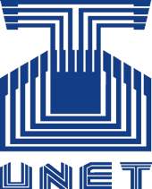

  

## Monitoreo de Sistema
### Proyecto de Sistemas Operativos

Esta es una aplicación de monitoreo de sistema operativo multiplataforma para Windows y Linux, desarrollada para ser ejecutada en consola, la cual recibe una serie de argumentos con los que se ejecuta un metodo distinto para cada argumento, dichos argumentos se listan a continuacion y se dividen segun su proposito:

***Seccion de Sistema***

**--kernel-version:** Muestra la versión del kernel linux actual. 
**--running-processes:** Número de procesos ejecutándose en el sistema. 
**--current-user:** Muestra el nombre usuario con el cual fue ejecutado el programa. 
**--date-time:** Muestra la hora y fecha actual del sistema (formato y hora de Venezuela). 
**--uptime:** Muestra el tiempo que ha estado encendida la computadora.

***Seccion de Memoria***

**--mem-total:** Total de memoria RAM. 
**--mem-total-free:** Total de memoria RAM libre. 
**--mem-swap:** Total de memoria SWAP. 
**--mem-swap-free:** Total de memoria SWAP libre en el sistema. 

***Seccion de Disco***

**--disk-list:** Lista los discos existentes en el sistema. 
**--disk-space:** Muestra el espacio usado en los discos montados. 
**--partitions-list:** Lista las particiones existentes en todos las unidades del sistema. 

***Seccion de Redes***

**--net-list:** Lista las interfaces de red. 
**--net-list-ip:** Lista las interfaces de red junto a su IP (si tiene asignada). 

### Desarrolladores
* [David Chacón (@DavidL28D)](https://github.com/DavidL28D)
* [Yeison Fuentes (@Yeisonryhn)](https://github.com/Yeisonryhn)
* [Adriana Delgado (@adrianaedc)](https://github.com/adrianaedc)

*Proyecto desarrollado con propositos educativos para la **Universidad Nacional Experimental del Táchira***
